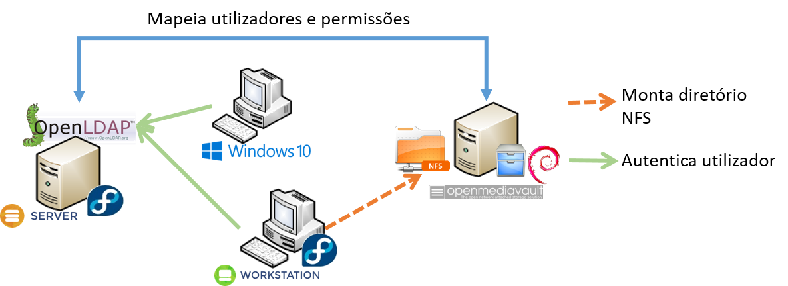

# System Administration Project
This project consists of an directory information system based on LDAP for authentication and for exporting user directories using NFS.

# Goals 
1. Have a RAID/LVM system on the [OMV](#server---openmediavault) machine.
2. Export directories on the [OMV](#server---openmediavault) via NFS or SAMBA.
3. Have openLDAP on the [server](#server---openldap) to authenticate users on [Desktop](#fedora---workstation) and [Win10](#windows-10).
4. Use LDAP to know which directories are needed to mount for the user authenticated.
5. Mount on [Desktop](#fedora---workstation) the directories of the authenticated user via NFS or SAMBA. 

# Table of Contents
- [System Administration Project](#system-administration-project)
- [Goals](#goals)
- [Table of Contents](#table-of-contents)
- [Virtual machines specs](#virtual-machines-specs)
  - [Fedora - Workstation](#fedora---workstation)
  - [Server - OpenMediaVault](#server---openmediavault)
  - [Server - OpenLDAP](#server---openldap)
  - [Windows 10](#windows-10)
- [Fedora - Workstation](#fedora---workstation-1)
- [Server - OpenMediaVault](#server---openmediavault-1)
  - [Installing OpenMediaVault on debian 11](#installing-openmediavault-on-debian-11)
- [Server - OpenLDAP](#server---openldap-1)

# Virtual machines specs
## Fedora - Workstation

    Type: e2-micro
    Location: europe-west1-d
    OS: Fedora-36
    External IP: 34.77.37.203

## Server - OpenMediaVault

    Type: e2-micro
    Location: europe-west1-b
    OS: Debian-11
    External IP: 35.195.233.30

## Server - OpenLDAP

    Type: e2-micro
    Location: europe-west1-b
    OS: CentOS-7
    External IP: 35.240.73.58

## Windows 10

# Fedora - Workstation

# Server - OpenMediaVault

## Installing OpenMediaVault on debian 11

**Note: Remember to permit HTTP/HTTPS traffic (WebUI must run on port 80 or 443 or it will be blocked by the firewall)**

[Instruction Used](https://docs.openmediavault.org/en/6.x/installation/on_debian.html)

# Server - OpenLDAP
