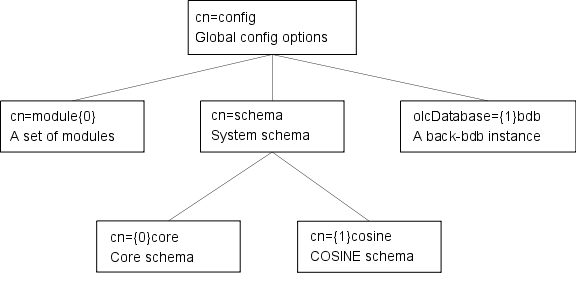

- [Systemd](#systemd)
- [LDAP](#ldap)
  - [Attributes](#attributes)
  - [Object Classes](#object-classes)
  - [Schemas](#schemas)
- [SSSD](#sssd)
- [Fuser](#fuser)
- [LSOF](#lsof)
- [Access Control Lists in linux (setfacl, getfacl)](#access-control-lists-in-linux-setfacl-getfacl)

# Systemd

**A System and service manager, an init system used to bootstrap user space and manage user processes.**

Systemd is a system that is designed specifically for the Linux kernel. It replaces the sysvinit process to become the first process with PID = 1, which gets executed in user space during the Linux start-up process.  

Managing services with systemd:\
Below is the list of some useful systemd utilities along with a brief description of what they do:

**systemctl**: It Controls the systemd system and services.\
**journalctl**: Used To manage journal, systemd’s own logging system.\
**hostnamectl**: Can Control hostname.\
**localectl**: Helps Configure system local and keyboard layout.\
**timedatectl**: Used to Set time and date.\
**systemd-cgls**: It Shows cgroup contents.\
**systemadm**: It is a Front-end for systemctl command.\

# LDAP
[Simple Explanation of what is OpenLDAP, LDAP, slapd](https://www.youtube.com/watch?v=l8BwMlPRMF8)

LDAP = X.500 + TCP/IP

## Attributes 
- CN = Common Name
- OU = Organizational Unit
- DC = Domain Component
- DN = Distinguished Names 
- C = country

<figure>

<figcaption align = "center"><b>Example of an LDAP directory structure with distinguished names and relative distinguished names.</b></figcaption>
</figure>

## Object Classes
Set of attributes
- Person = CN + SN
- Country = C
Note: Optional attributes are also possible in object classes

## Schemas  
Plugins (Attributes + Object Classes)
- PosixAccount composed by: VID, Shell, home, GID
Note: PosixAccount = Object class Used in /etc/passwd composed by attributes

The slapd configuration is stored as a special LDAP directory with a predefined schema and DIT. There are specific objectClasses used to carry global configuration options, schema definitions, backend and database definitions, and assorted other items

<figure>

<figcaption align = "center"><b>Sample configuration tree.</b></figcaption>
</figure>

<figure>

<figcaption align = "center"><b>Slapd config files from the OpenLDAP Server</b></figcaption>
</figure>

`olcDatabase={1}monitor.ldif`: `olc` = OpenLDAPConfig, `Database={1}` = the matching database, `monitor` = who has access to the DB.

`olcDatabase={1}hdb.ldif`: `hdb` = The database where all the data is stored.  

# SSSD
The System Security Services Daemon (SSSD) is a system service to access remote directories and authentication mechanisms. It connects a local system (an SSSD client) to an external back-end system (a provider). 

# Fuser 
Tells which processes are using a file 
```
fuser ./
  2078rce 2083rce 2105rce ... 
```
`r`: root
`c`: current directory
`e`: executing

# LSOF
List of all Open Files. Useful for a lot of cases such as: searching for processes still using old libraries, checking how many processes are using a file, searching ports that are listening to a specific port or ip (via -i option).

# Access Control Lists in linux (setfacl, getfacl)
Allow a more granular control of resources. Allows you to grant to permissions to people/groups that are not the file owner.

- If a specific file permission produce a `+` when executing `ls -l`, then that file has a ACL associated with it.
- Add a User ACL: `setfacl -m u:{userName}:[r][w][x] {file}`
- Add a Group ACL: `setfacl -m g:{groupName}:[r][w][x] {file}`
- Check a ACL: `getfacl {file}` 